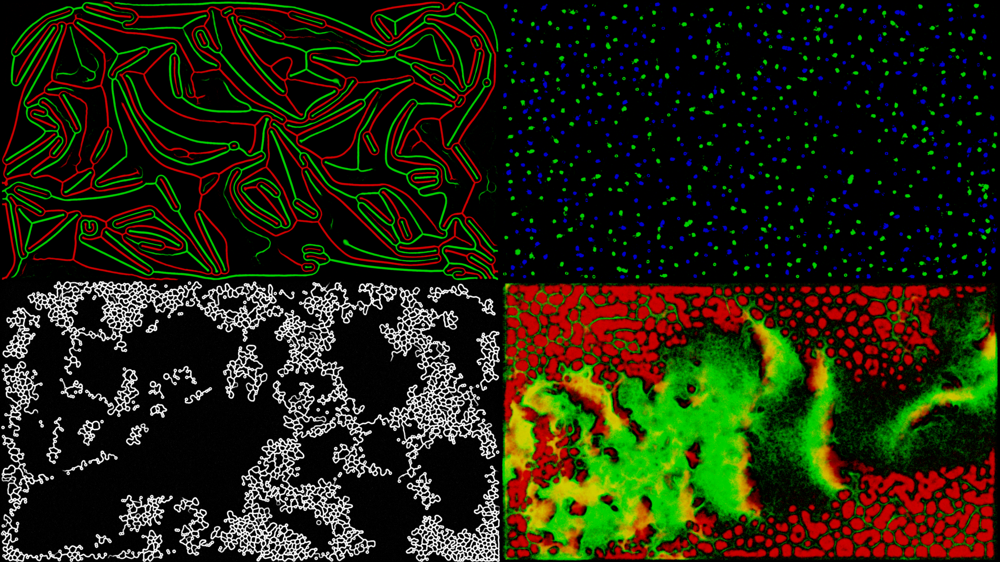

# SlimeSimulation

## Features
* Multi-particle simulations (up to 2 particles)
* Background support
* Different colors for particles
* Changing the current configuration in realtime
* Automatically cycle rules and settings

## Configuration
The configuration can be changed in the **settings.txt** file\
Following settings can be adjusted:
1. Start application in the background for the selected monitor
2. Default monitor
3. V-Sync factor
4. Background Color
5. Time between setting changes
6. Number of frames when a transition happens
7. Color for the particles
8. All the rules and their configurations

A rule configuration can be added by incrementing the configuration number for that specific rule and adding the *configuration block*.\
The *configuration block* can be copied by pressing the Copy2Clip button.
A *configuration block* consists of the following 7 things:
* Angle of the left and right sensor
* Distance of the middle, left and right sensor
* Steering angle
* Walking distance
* Deposit strength
* Diffuse strength
* Decay strength

## Controls

When the application is in the background press "CTRL + LEFT_ALT + G" to bring it back into windowed mode.

## Requirements

* Windows 7, 8 or 10
* GPU with DirectX 12 support
* [Visual C++ Redistributable x64](https://support.microsoft.com/de-de/topic/aktuelle-unterst%C3%BCtzte-downloads-f%C3%BCr-visual-c-2647da03-1eea-4433-9aff-95f26a218cc0)

## Implementation

This project is implemented in C++ with the DirectX 12 API and ImGui for the GUI.\
In order to improve the usability of DirectX a small Engine has been writen. This Engine is located in the [Engine folder](SlimeSimulation/Engine).\
The main application files are located in the src folder.

## Credit
Inspiration for this project was taken from:
https://www.youtube.com/watch?v=X-iSQQgOd1A&t=1s&ab_channel=SebastianLague

## GIFS

  
   

